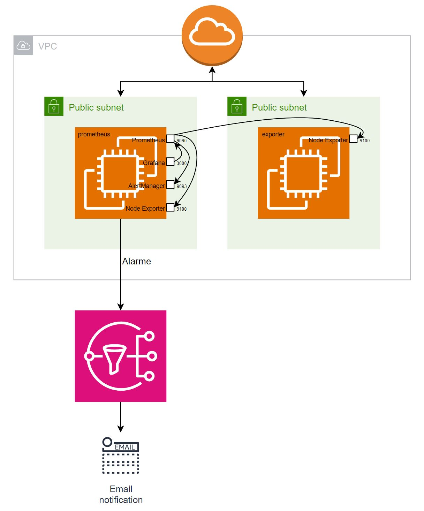

# Monitoring_EC2s
Automated setting-up of 2 EC2-Instances with Grafana, Prometheus, Node Exporter and AlertManager installed and SNS-Topic for alarm-forwarding - Using Terraform and Ansible

 

Infrastruktur-Beschreibung:
In einer VPC werden 2 Subnetze eingerichtet, in dem jeweils eine EC2-Instanz getstartet wird.

Auf einer EC2-Instance werden Prometheus (Monitoring und Alerting), der zugehörige Node-Exporter (Metrikenabfrage) und der Alertmanager (Alerting), sowie Grafana (Visualisierung der Metriken) installiert und so eingerichtet, dass sie sowohl von dieser Instance als auch von der zweiten Instance, auf der der Node-Exporter installiert wurde, Metriken sammelt und entsprechend visualisert darstellt.

Parallel wurde ein SNS-Topic eingerichtet, dass die Alarme des AlertManagers so verarbeitet, dass eine E-Mail an mich geschickt wird.

Terraform-Updates:
- SSH-Key als Variable in "dev_vars.auto.tfvars"-Datei
- Instance-AMI und Instance-Typ als Variable in dem EC2-Modul
- Subnet-CIDRs und Availability-Zones als Variable für VPC-Modul

Ansible-Updates:
- hosts-Datei in Init-Schreibweise inkl. Übergabe von gemeinsamen Variablen an die unterschiedlichen Hosts
- 